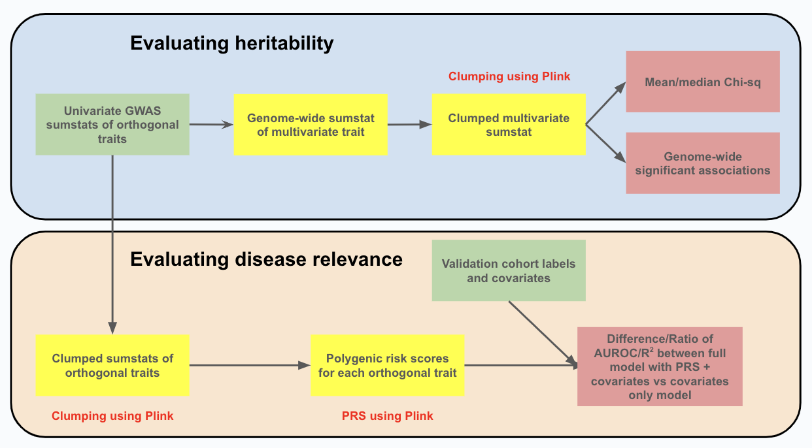

# EmbedGEM


EmbedGEM (*Embed*ding *G*enetic *E*valuation *M*ethods) is a Python-based tool for evaluating the utility of machine learning derived embeddings in genetic discovery. It compares traits based on their heritability and ability to identify 'disease relevant' variants. The framework uses genome-wide significant signals and chi-square statistics for heritability evaluation, and computes polygenic risk scores for disease relevance assessment. EmbedGEM is designed for extensibility with more metrics. Its effectiveness has been demonstrated on synthetic and UK Biobank datasets. The workflow of EmbedGEM can be seen below.

[Link to paper](https://www.biorxiv.org/content/10.1101/2023.11.24.568344v1)




## Setup

### Local
We recommend using [conda](https://docs.conda.io/projects/miniconda/en/latest/miniconda-install.html)
to set up a virtual environment for this workflow.
Once you have conda installed, you can create your environment from within the `workflow` directory using:

```sh
cd workflow/
conda env create -n embedgem --file environment.yml --solver libmamba
```

> [!NOTE]
> If you are using Apple silicon (M1/M2/M3), you will need to update the `environment.yml` file by updating the channels
> as follows. This forces conda to pick the correct plink binary during installation.
```
channels:
  - conda-forge
  - bioconda/osx-64
  - bioconda
  - defaults
```

### AWS Batch
To run this workflow on larger datasets, you can generate results faster by running on AWS batch. The workflow is
already set up to run on batch by using [redun](https://github.com/insitro/redun).

#### Docker image creation
When running full redun tasks on AWS Batch, we need a docker image with the proper environment

```sh
cd docker/
make setup
```

Now, we can use the following make command to build our Docker image.
By default, it will read the currently active AWS profile.
To specify a specific registry and image name, please edit the variables in [Makefile](workflow/docker/Makefile).

```sh
make login
make build
```

After the image builds, we need to publish it to ECR so that it is accessible by AWS Batch.
There are several steps for doing that, which are covered in these make commands:

```sh
# If the docker repo does not exist yet.
make create-repo

# Push the locally built image to ECR.
make push
```

#### Redun configuration

To run tasks on AWS Batch, we need three things:

* An AWS Batch queue that we can submit to.
* A Docker image published in ECR that contains the redun and any other commands we wish to run.
* An S3 prefix redun can use for scratch space (communicating task input/output values).

Once we have these resources ready, we can configure redun to use them using the
[.redun/redun.ini](workflow/.redun/redun.ini) file in our workflow directory.

For more detailed information on how to configure redun, check out the official
[redun tutorial for AWS batch](https://github.com/insitro/redun/tree/main/examples/05_aws_batch)
and the [redun docs](https://insitro.github.io/redun/).


## Test Dataset
A test dataset is provided in [test_dataset_s3.yaml](workflow/test_dataset_s3.yaml).
Assuming the redun.ini configuration is updated as described above, update the yaml to use a `s3_output_path` in your environment.
The test dataset can be run with:

```
redun run generate_dataset.py main --config ./test_dataset_s3.yaml
```

An example of the test output is found at: `s3://2023-embedgem/toy_data_sample_output/`

## EmbedGEM workflow configuration

### Required parameters for workflow
The configuration file contains several required parameters:

- `pheno_prefix`: Prefix of phenotype. Outputs will be prefixed with this term.
- `sumstat_dirs`: This is a list where each entry is a directory with a GWAS sumstat file that represents one of the principal components (or traits orthogonalized using other methods). The sumstat file is assumed to be called `genomewide.sumstat`.
- `s3_output_path`: Directory where the outputs will be stored on S3.
- `bfile_template`: Naming format of chromosome level plink bfiles (should have bim/bam/fam) for discovery cohort. This is a template containing the string `{CHROM}` that represents the chromosome shard.

#### In disease_relevance_options:
- `disease_relevance_bfile_template`: Naming format of chromosome level plink bfiles (should have bim/bam/fam) for disease relevance evaluation. This is a template containing the string `{CHROM}` that represents the chromosome shard. See example yaml file.
- `pheno_file`: Location of phenotype file to assess disease relevance.
- `covar_file`: Location of covariate file to assess disease relevance.
- `pheno_id_col`: Name of ID column in phenotype file.
- `cov_id_col`: Name of ID column in covariate file.
- `cov_cols`: Names of covariate columns in covariate file.
- `pheno_type`: Type of phenotype. Can either be 'continuous' or 'binary'.
- `pheno_col`: Name of phenotype column in phenotype file.
- `pheno_sep`: Separator for phenotype file.
- `cov_sep`: Separator for covariate file.

### Optional Parameters for workflow

The configuration file contains several optional parameters:

- `chromosomes`: Defaults to all chromosomes.

#### In heritability_eval
- `pval_thresh`: Default value is 5e-8.
- `max_p`: Default value is 5e-8. This subsets variants for more efficient operation. Please set to 1 if you want the full multivariate summary statistics.

#### In clumping
- `maf_threshold`: Default value is 0.0001.
- `max_kb`: Default value is 250.
- `max_pval_all_variants`: Default value is 1e-5.
- `max_pval_lead_variants`: Default value is 5e-8.
- `min_r2`: Default value is 0.5.

#### In disease_relevance_options
- `boot_reps`: Default value is 2000.


## Expected format for input summary statistics files

The following columns in a tab separated format are expected for each input summary statistics file. We also assume each
GWAS is in a dedicated directory with file named `genomewide.sumstat`:

| Column  | Description                                                    |
|---------|----------------------------------------------------------------|
| ID      | Variant identifier. This should be consistent across sumstats. |
| P       | P-values from the association test                             |
| POS     | Base-pair coordinate of each variant                           |
| #CHROM  | Chromosome of each variant                                     |
| A1      | The tested allele                                              |
| REF     | Reference allele                                               |
| ALT     | Alternate allele                                               |
| A1_FREQ | A1 allele frequency                                            |
| BETA    | Effect size from the association test                          |

Note: that the workflow assumes that the ID is consistent across the summary statistics files and the summary statistics are generated using the same GWAS pipeline on the same set of samples and covariates. If this is not true, the workflow will not generate meaningful outputs. 

## Running the workflow

After setting up your configuration file, the workflow can be run using:

```
redun run generate_dataset.py main --config config.yaml
```
## Directory structure of outputs
Shown below is the example output directory structure of a single EmbedGEM run.

```
output/
    disease_relevance_eval/
        prs_df.tsv
        multivariate_associations.csv
        scratch/
            clumping/
                PC0/
                    chr3.clumped
                    chr4.clumped
                    chr1_clumped.sumstat
                    chr1.clumped
                    chr3_clumped.sumstat
                    chr2_clumped.sumstat
                    chr2.clumped
                PC1/
                    chr1_clumped.sumstat
                    chr1.clumped
                    chr2.clumped
                    chr2_clumped.sumstat
                    chr3.clumped
                    chr4.clumped
                    chr3_clumped.sumstat
            trait_level_prs/
                PC0/
                    genomewide.prs
                    prs_chr1.log
                    prs_chr2.log
                    prs_chr1.prs
                    prs_chr3.log
                    prs_chr3.prs
                    prs_chr2.prs
                PC1/
                    genomewide.prs
                    prs_chr2.log
                    prs_chr1.prs
                    prs_chr2.prs
                    prs_chr3.log
                    prs_chr3.prs
                    prs_chr1.log
    heritability_eval/
        chr2.clumped
        chr4.clumped
        clumped_metrics.tsv
        chr3_clumped.sumstat
        chr2_clumped.sumstat
        chr3.clumped
        chr1_clumped.sumstat
        chr1.clumped
        scratch/
            multivariate_chr3.csv
            multivariate_chr2.csv
            multivariate_metrics.csv
            multivariate_chr1.csv
            multivariate_chr4.csv
            multivariate_genomewide.csv
```

The folder `disease_relevance_eval` contains the metrics for the evaluation of disease relevance in `multivariate_associations.csv`. Any intermediate files generated in the process are stored in the `scratch` sub-folder. Similarly, the folder `heritability_eval` stores the metrics for the heritability evaluation in `clumped_metrics.tsv`. The `scratch` sub-folder contains the intermediate outputs generated in the process.

## Citing EmbedGEM 
If you use EmbedGEM in your research, please cite it as: 
```
@article{mukherjee2023embedgem,
  title={EmbedGEM: A framework to evaluate the utility of embeddings for genetic discovery},
  author={Mukherjee, Sumit and McCaw, Zachary R and Pei, Jingwen and Merkoulovitch, Anna and Tandon, Raghav and Soare, Thomas W and Amar, David and Somineni, Hari and Klein, Christoph and Satapati, Santhosh and others},
  journal={bioRxiv},
  pages={2023--11},
  year={2023},
  publisher={Cold Spring Harbor Laboratory}
}
```
